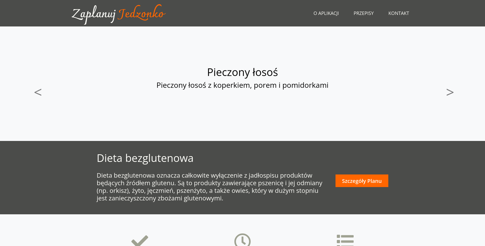
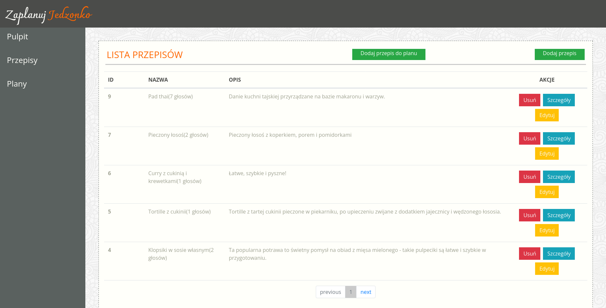

# zaplanuj-jedzonko
> ### Simple meal planning application.
> Live demo [_here_](https://www.example.com). <!-- If you have the project hosted somewhere, include the link here. -->

## Table of Contents
* [General Info](#general-information)
* [Technologies Used](#technologies-used)
* [Features](#features)
* [Screenshots](#screenshots)
* [Setup](#setup)
* [Project Status](#project-status)
* [Room for Improvement](#room-for-improvement)
* [Acknowledgements](#acknowledgements)
* [Contact](#contact)
<!-- * [License](#license) -->

## General Information
The app promotes healthy eating and emphasises the important role meal planning plays in it. I hope, that the ease of choosing between different diet options and the ability to assign meals to specific eating plans will improve the quality of life for many people.
<!-- You don't have to answer all the questions - just the ones relevant to your project. -->

## Technologies Used
- Python - version 3.10.6
- Django - version 3.2
- PostgreSQL - version 14.5

## Features
List the ready features here:
- adding and modifying recipes
- displaying a list of recipes
- creating, displaying and modifying the feeding schedule
- voting on recipes (like/dislike)
- carousel with recipes on the home page
- pagination of recipes and nutrition plans

## Screenshots

<!-- If you have screenshots you'd like to share, include them here. -->

## Setup
Requirements/dependencies are listed in a requirements.txt file which is located in the project's main directory.

## Project Status
Project is: _in progress_

## Room for Improvement
Room for improvement:
- adding meals to the plan in the right order
- like/dislike buttons

To do:
- deleting recipes
- deleting and editing plans

## Acknowledgements
- This project was based on ScrumLab workshop in Coders Lab IT school.
- Many thanks to my Scrum team!

## Contact
Co-created by [@skkaz7](https://www.linkedin.com/in/sebastian-kazmierczak) - feel free to contact me!

<!-- Optional -->
<!-- ## License -->
<!-- This project is open source and available under the [... License](). -->

<!-- You don't have to include all sections - just the one's relevant to your project -->
